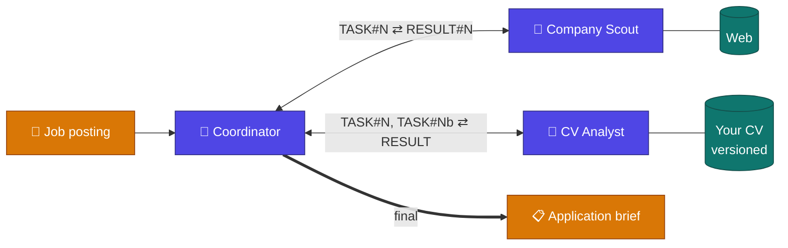
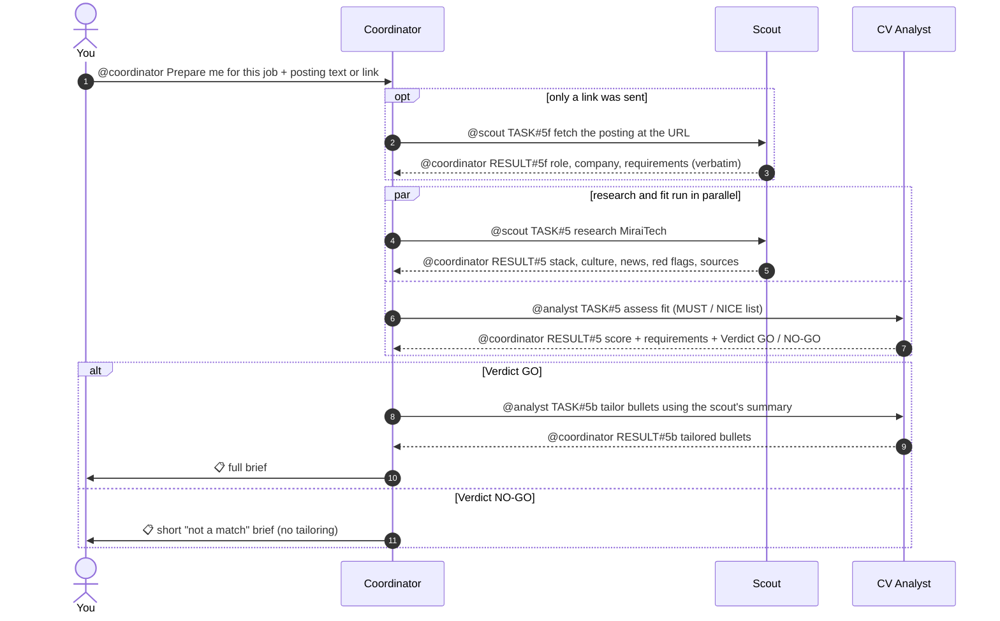
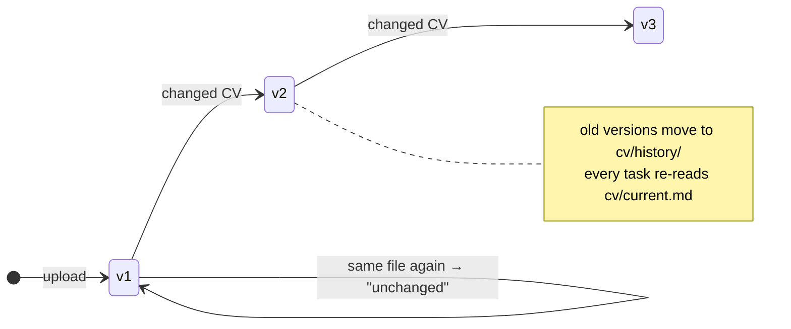

<div align="center">

# Job War Room

**Three AI agents in one Telegram group that turn a job posting into a ready-to-use application brief.**


</div>

You paste a job posting (or just a link to it) into the group. A **Coordinator** bot splits the work and hands it off by @mention: a **Company Scout** researches the employer on the web, and a **CV Analyst** checks the posting against **your latest CV** and tailors your bullets. The Coordinator collects the results and sends you one brief. Each bot is a separate [Hermes Agent](https://github.com/NousResearch/hermes-agent) with its own model, tools, memory and Telegram account.



If you clearly don't fit the job, you get a short **"not a match"** brief instead (what's missing, what would close the gap), and nobody wastes time polishing a CV for it. Otherwise the brief contains: a **fit score**, requirements met / partly met / missing (with quoted CV evidence), a company summary with **red flags**, **tailored CV bullets**, likely interview questions, questions to ask the employer, and next steps.

## Agents

| | Agent | Bot (this deployment) | Model | Tools | Job |
|---|---|---|---|---|---|
| 🧭 | **Coordinator** | `@alish_hr_coordinator_bot` | `gpt-5.4-mini` | memory, session_search, todo, skills | Splits the request, hands off by @mention, tracks results, writes the brief |
| 🔎 | **Company Scout** | `@alish_company_scout_bot` | `gpt-5.6-luna` | web, memory | Researches the company and fetches postings from links. **Never sees the CV** |
| 📄 | **CV Analyst** | `@alish_cv_analyst_bot` | `gpt-5.6-terra` | file, terminal, memory, skills | Stores the CV with versions, judges fit by meaning (not keywords), tailors bullets. **No web access** |

The split is deliberate: the web-facing agent never holds your CV, so a malicious web page can't leak it. Each agent gets only the tools and model its role needs. The reasoning is in [docs/report.md](docs/report.md).

## How it works

### Handoff protocol

Bots talk to each other in the group with plain @mentions and numbered tasks. Specialists only act on messages that mention them, and they only ever reply to the Coordinator.



| Message | Meaning |
|---|---|
| `@bot TASK#N <instruction>` | Coordinator hands off a subtask (`N` is the task id; `Nb` is the dependent tailoring step) |
| `@coordinator RESULT#N <payload>` | A specialist returns its result |
| `@coordinator FAILED#N <reason>` | A specialist couldn't do it. The brief still goes out, with a note about what's missing |
| `TASK#Nf` | Only for links: the Scout fetches the posting first. If it fails, you're asked to paste the text |

**Fit gate.** The Analyst ends every fit result with `Verdict: GO` or `NO-GO`. NO-GO means a score below 50, or two or more MUST requirements missing. On NO-GO the Coordinator skips tailoring and sends the short brief. Reply `tailor anyway` if you want the bullets regardless.

**Loop protection** works in layers: prompt rules in each `SOUL.md`, mention-only gating in each bot's Telegram config, Hermes' `bot_loop_guard` (bot messages are dropped after 20 in 5 minutes), and bots ignoring their own messages. Details are in [report Q3](docs/report.md).

### Your CV: upload once, newest wins



The CV is extracted to text by a deterministic helper (`cv_store.py`), not by the model. It refuses scans with no text layer, so a bad upload never replaces a good CV. It lives only in `~/.hermes/profiles/cv-analyst/cv/` and never in the repo.

## Quick start

> [!NOTE]
> You need Hermes Agent ≥ 0.21 with a working default profile: `hermes` runs, and `~/.hermes/.env` contains `OPENAI_API_KEY` and `TELEGRAM_ALLOWED_USERS=<your Telegram user id>`. The gateway must run with `gateway.multiplex_profiles: true` (the default). PDF CVs also need `pdftotext` (`sudo apt install poppler-utils`).

### 1. Create three Telegram bots

In [@BotFather](https://t.me/BotFather), for each agent:

1. `/newbot`, then pick a name and a username ending in `bot`.
2. `/mybots` → your bot → **Bot Settings → Group Privacy → Turn off**.
3. Open the BotFather **mini app** (the *Open* button next to the message field) → your bot → enable **Bot-to-Bot Communication**.

> [!IMPORTANT]
> Without step 3, Telegram doesn't deliver one bot's messages to another, and every handoff silently fails.

Then put the three usernames (without `@`) into [`bots.env`](bots.env). `setup.sh` fills them into every prompt and skill, so there's nothing else to edit.

```bash
COORDINATOR_BOT=my_coordinator_bot
SCOUT_BOT=my_scout_bot
ANALYST_BOT=my_cv_analyst_bot
```

### 2. Create the group

Create a group (e.g. "Job War Room"), add the three bots, and make all three **admins**.

### 3. Install the agents

```bash
git clone https://github.com/shoplikov/hermes-telegram-hiring-agents.git ~/job-war-room
cd ~/job-war-room
scripts/setup.sh                    # creates Hermes profiles: coordinator, scout, cv-analyst
scripts/set-token.sh coordinator    # paste the token at the hidden prompt
scripts/set-token.sh scout
scripts/set-token.sh cv-analyst
```

> [!WARNING]
> Run `set-token.sh` in a real terminal. Never paste a bot token into a chat, including an AI assistant. If you do, revoke it in BotFather.

<details>
<summary>What <code>setup.sh</code> does</summary>

- Copies each `agents/<name>/config.yaml` into `~/.hermes/profiles/<name>/`, filling in the repo path.
- Renders `SOUL.md` and the skills into the profile, filling in the usernames from `bots.env`.
- Copies `OPENAI_API_KEY` and `TELEGRAM_ALLOWED_USERS` from the default profile without printing them.
- Links `cv_store.py` to a stable path: `~/.hermes/profiles/cv-analyst/bin/`.
- Warns if `hermes`, `pdftotext` or the step-4 setting is missing.

It's idempotent: re-run it after editing anything under `agents/` or `bots.env` (`check.sh` warns if you forgot).

</details>

### 4. Share one session per group

With a multiplexed gateway, `group_sessions_per_user` is read from the **default** profile only. The Coordinator has to see your request and the specialists' results in the same session, so add this to `~/.hermes/config.yaml`:

```yaml
group_sessions_per_user: false
```

This affects groups only, not DMs. Without it you get duplicate handoffs and duplicate briefs ([failure #5](docs/failures.md)).

### 5. Start and verify

```bash
hermes gateway restart
hermes profile list     # coordinator, scout and cv-analyst show "running"
scripts/check.sh        # every line should say "ok" (never prints secrets)
```

## Usage

| Step | Send in the group | You get |
|---|---|---|
| 1. Upload your CV | the PDF/DOCX with the caption `@<analyst_bot> new CV` | `✅ CV v1 saved …`. The same file again gives "Same CV as v1"; a changed file gives v2 and a summary of what changed |
| 2. Ask for a brief | `@<coordinator_bot> Prepare me for this job:` + the posting text **or a link** | Visible handoffs (`TASK#N`, `RESULT#N`, `TASK#Nb`), then 📋 the brief, in about 1–2 minutes. A poor fit gets the short version |
| 3. Check progress | `@<coordinator_bot> status` | The list of pending subtasks |
| 4. Tailor after a NO-GO | `@<coordinator_bot> tailor anyway` | Tailored bullets for the last task |

> [!TIP]
> Links work for public pages (hh.kz, Greenhouse, company career sites). If a page needs a login (e.g. LinkedIn), the Coordinator asks you to paste the text. Address one bot per message: a message that mentions several bots wakes all of them.

`<coordinator_bot>` and `<analyst_bot>` are the usernames from `bots.env`. In this deployment they're `@alish_hr_coordinator_bot` and `@alish_cv_analyst_bot`.

A full real run, message by message, is in [docs/demo/transcript.md](docs/demo/transcript.md).

## Project structure

```text
bots.env                 # your three bot usernames (filled into prompts by setup.sh)
agents/
├── coordinator/         # config.yaml, SOUL.md, .env.example
│   └── skills/brief-format/
├── scout/               # config.yaml, SOUL.md, .env.example
└── cv-analyst/          # config.yaml, SOUL.md, .env.example
    └── skills/
        ├── cv-store/        # SKILL.md + scripts/cv_store.py (versioned CV storage)
        └── fit-assessment/  # requirement-by-requirement fit rubric
scripts/
├── setup.sh             # installs the agents as Hermes profiles (idempotent)
├── set-token.sh         # stores one bot token without echoing it
└── check.sh             # verifies the install, never prints secrets
tests/test_cv_store.py   # unit tests for the CV store
docs/
├── report.md            # architecture + answers to defense questions Q1–Q7
├── failures.md          # 13 real failures: symptom, cause, fix
├── demo/transcript.md   # end-to-end runs before and after the fixes
└── superpowers/         # design spec and implementation plan
```

**No secrets in the repo.** Bot tokens and the OpenAI key live only in `~/.hermes/profiles/<name>/.env` (mode 600). Only `.env.example` files are tracked.

## Testing

```bash
uv run pytest -q
```

Covers `cv_store.py`: versioning and history, unchanged detection (same bytes or same text), refusing image-only or near-empty PDFs, PDF/DOCX extraction, and recovery from a corrupt or half-deleted store without losing the old CV.

## Troubleshooting

| Symptom | Fix |
|---|---|
| Specialists never react to the Coordinator | Enable **Bot-to-Bot Communication** (step 1.3). The bots must be admins with privacy off |
| Duplicate handoffs or duplicate briefs | Set `group_sessions_per_user: false` in the **default** profile config (step 4), then restart the gateway |
| A bot ignores a message | The message must @mention that bot. For files, the mention goes in the caption |
| "Couldn't read the link" | The page needs a login or blocks bots. Paste the posting text instead |
| Analyst says "no CV stored" | Upload a CV first (Usage step 1) |
| `set-token.sh` says it needs an interactive terminal | Run it in a normal terminal, not through an AI assistant's shell |
| Not sure what's misconfigured | `scripts/check.sh` lists every failing check |

## Assignment checklist

| Requirement | Where |
|---|---|
| ≥ 3 Hermes agents, each with its own Telegram bot (1 coordinator + 2 specialists) | [`agents/`](agents) · [Agents](#agents) |
| Handoffs between bots by @mention | [Handoff protocol](#handoff-protocol) · each `SOUL.md` · [transcript](docs/demo/transcript.md) |
| Working end-to-end flow | 5 real postings. Clean post-fix run TASK#5 in the [transcript](docs/demo/transcript.md) |
| Each agent's config and `SOUL.md` | `agents/*/config.yaml`, `agents/*/SOUL.md`, `agents/*/skills/` |
| README with setup steps | [Quick start](#quick-start) |
| No API keys or bot tokens committed | Only `.env.example` files are tracked |
| Defense questions Q1–Q7 | [docs/report.md](docs/report.md) §3 |
| A real failure example | [docs/failures.md](docs/failures.md). #5 is the main one |

## Acknowledgements

Built on [Hermes Agent](https://github.com/NousResearch/hermes-agent) by Nous Research.
