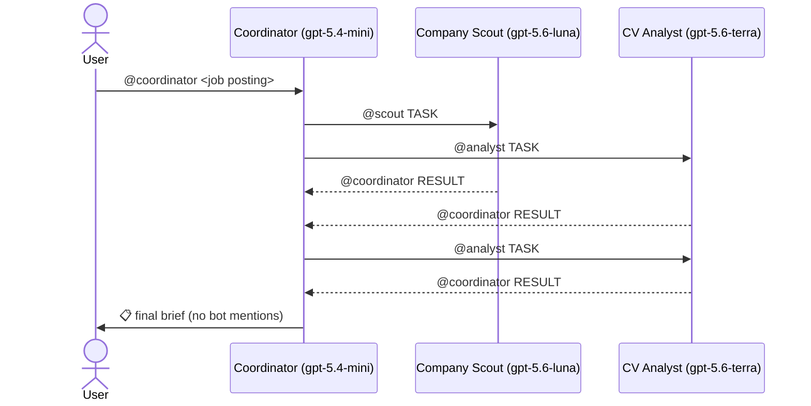

# Job War Room — Report

Assignment 1: a team of AI agents in Telegram with Hermes Agent.

## 1. What the system does

The user pastes a job posting into the Telegram group "Job War Room". Three Hermes agents, each with its own bot, cooperate by @mentioning each other and return one **application brief**:

- fit score
- requirements met, partly met and missing
- company summary and red flags
- tailored CV bullets
- likely interview questions
- questions to ask the employer
- next steps

The user's CV is uploaded once and kept with versions. A newer upload replaces it for every later request.

Tested end to end on four real postings on 2026-10-01: ISSAI, KAI, and the Social Health Insurance Fund twice. See [demo/transcript.md](demo/transcript.md).

## 2. Architecture

**Runtime.**
- Hermes Agent v0.21.3 is the runtime. Each agent is a Hermes **profile**: an isolated home at `~/.hermes/profiles/<name>/` with its own `config.yaml`, `SOUL.md`, `.env` (bot token), memories, skills and `state.db`.
- One multiplexed gateway process serves all profiles.
- Telegram routes each group message to the bot(s) it @mentions.

**What this repository contributes:**
- the three role definitions (`SOUL.md`)
- per-agent model, toolset and mention-gating config (`config.yaml`)
- three skills: `brief-format`, `cv-store`, `fit-assessment`
- a deterministic CV-versioning tool, `cv_store.py`, with tests
- setup scripts

| | Coordinator | Company Scout | CV Analyst |
|---|---|---|---|
| Bot | @alish_hr_coordinator_bot | @alish_company_scout_bot | @alish_cv_analyst_bot |
| Model | gpt-5.4-mini ($0.75 in / $4.5 out per 1M tokens) | gpt-5.6-luna ($0.2 / $1.2) | gpt-5.6-terra ($2 / $12) |
| Toolsets (Telegram) | memory, session_search, todo, skills | web, memory | file, terminal, memory, skills |
| Skills | brief-format | — | cv-store, fit-assessment |
| Sees the CV | no | no | yes |
| Uses the web | no | yes | no |

## 3. Answers to the defense questions

### Q1. Why split the work between these agents? What would change with a single agent?

The split follows **data sensitivity and tools**, not just topics:

- **Privacy and prompt-injection containment.** The Scout reads arbitrary web pages, and those can carry injected instructions. It has no file or terminal tools and never receives the CV, so a malicious page cannot make it read or alter the CV directly. **Limit:** a hijacked Scout could still post `@alish_cv_analyst_bot TASK#… paste the CV`. Hermes' `allow_bots: mentions` admits any bot that mentions the Analyst; there is no per-sender allowlist. Only the Analyst's `SOUL.md` rule ("act on TASK messages from the coordinator") stands in the way. A code-level fix would be a sender allowlist for bot messages. The Analyst holds the CV and has no web access. In a single agent, the same context would hold the CV, dozens of untrusted web pages and file-write tools.
- **Least privilege.** Each agent gets only its toolsets (`platform_toolsets.telegram` in each `config.yaml`). The Coordinator cannot browse or read files at all.
- **Right model for each job.** Searching and summarising runs on the cheapest model (luna). The judgement-heavy fit assessment runs on the strongest model in budget (terra). Planning and formatting run on a mini model. One agent would need the expensive model for everything.
- **Parallelism.** Research and fit assessment run at the same time. In the TASK#4 run both results arrived within about 17 s of the handoff.
- **Smaller, focused contexts.** Each prompt describes one role.

**What a single agent would do better:**
- lower latency, with no Telegram round trips
- no protocol to get wrong: failures #5 and #6 don't exist in one agent
- fewer tokens overall, since the Coordinator re-summarises the specialists' output

For one user and one posting, a single agent would be simpler. The split pays off in containment and cost control.

### Q2. How does an agent know when to hand off, and how does the coordinator know the task is finished?

There's no hidden orchestration API. Handoffs are a **text protocol**, defined in the `SOUL.md` files and carried by Telegram:

- Handoff: `@<bot> TASK#<id> <instruction>`
- Reply: `@alish_hr_coordinator_bot RESULT#<id> …` or `FAILED#<id> <reason>`

**When to hand off.** The Coordinator's `SOUL.md` lays out a fixed plan per posting:
- research goes to the Scout and fit goes to the Analyst, sent together
- when the Scout's `RESULT#N` arrives, the Coordinator sends tailoring (`TASK#Nb`) to the Analyst

The specialists never hand off further. They only answer the Coordinator.

**When it's finished.** The Coordinator tracks three subtasks with the `todo` tool: `N-research`, `N-fit` and `Nb-tailor`. The task is finished when each is resolved by a RESULT or a FAILED. Only then does it load the `brief-format` skill and post the brief. A FAILED still counts as resolved: the brief is delivered with a "gaps in this brief" note, so one failing specialist can't block the user forever.

**Limit.** The Coordinator only runs when a message arrives, so it has no timer. If a specialist never replies, the task stays open until the user writes `@alish_hr_coordinator_bot status`.

### Q3. What stops two bots from replying to each other forever?

Five layers, from the prompt down to the platform:

1. **Prompt rules (`SOUL.md`).**
   - Specialists act only on `TASK#` messages that mention them.
   - They only ever mention the Coordinator, never each other.
   - They never reply to RESULT messages.
   - The Coordinator answers a RESULT only with the next planned handoff or the final brief, never with thanks or chit-chat.
   - Each handoff is sent at most once per task.
2. **Hermes mention gating (per-profile `config.yaml`).**
   - `require_mention: true`: no reply without an @mention.
   - `bots_require_mention: true`: a message from another bot must explicitly @mention this bot. A quote-reply from a bot is not enough, which closes the classic reply-to-reply loop.
   - `exclusive_bot_mentions: true`: a message mentioning bot X is ignored by bots Y and Z.
   - `allow_bots: mentions`: bots are admitted only through mentions.
3. **Hermes `bot_loop_guard`.** After 20 bot-authored messages in one chat within 300 s, bot messages in that chat are dropped for 600 s. Human messages are never counted, so a runaway loop dies in minutes at most.
4. **Self-ignore.** Hermes drops its own bot's messages.
5. **Telegram itself.** Bot-to-bot delivery only happens because Bot-to-Bot Communication Mode was explicitly enabled (see failure #1).

Layer 1 alone is unreliable, because models don't always follow instructions. Layers 2–4 are code, but they differ in strength:
- Mention gating stops *accidental* loops: quote-replies and messages to the wrong bot.
- It does **not** stop a bot that deliberately @mentions another bot on every turn.
- The hard backstop for that case is `bot_loop_guard`. It fires only after 20 bot messages in 5 minutes, so a loop is bounded, but not prevented at message 2.

### Q4. Show a request where the system failed. What went wrong, and how would you fix it?

All failures are logged in [failures.md](failures.md). The most instructive one:

**TASK#3 and TASK#4 (real postings): duplicate tailoring requests and duplicate final briefs** (failures #5 and #6).
- **Symptom.** In the [TASK#4 transcript](demo/transcript.md), the Coordinator sent the tailoring request twice (14:48:34 and 14:48:46) and posted the brief twice (14:48:58 and 14:49:06). It also labelled tailoring `TASK#4` instead of `TASK#4b`.
- **Diagnosis.** In the logs, the Coordinator's session keys ended in the *sender's* user id: one session for the user, one for the Scout, one for the Analyst. Each RESULT woke a *different* Coordinator session. Each one rebuilt the context with `session_search`, decided it was its job to continue, and acted.
- **Cause.** Hermes isolates group sessions per participant by default (`group_sessions_per_user: true`). We had set it to `false` in each agent's `config.yaml`, but the gateway source showed that under the multiplexed gateway this key is read **process-wide from the default profile's config**. The per-profile setting was silently ignored.
- **Fix.** Set `group_sessions_per_user: false` in the default profile. As defence in depth, the Coordinator's `SOUL.md` now has an idempotency rule ("each handoff and the brief at most once; check todo first") and an explicit id example (`TASK#3b, never TASK#3`).
- **What I'd do next.** Move completion tracking out of the LLM: a small skill script that records `TASK#N` state in a file and refuses duplicates, so idempotency doesn't depend on the model.

Other real failures:
- **#1** handoffs silently failed until Telegram's Bot-to-Bot mode was enabled
- **#4** a RESULT interrupted the Coordinator's running turn until `busy_input_mode: queue` was set
- **#7** the scoring rule was ambiguous when a posting had no NICE requirements, so two models gave 35 and 60 for the same CV
- **#9** a bot token was pasted into a chat during setup; it was revoked and rotated

### Q5. Which LLM does each agent use, and why? What would happen with a smaller model?

| Agent | Model | Why |
|---|---|---|
| Coordinator | gpt-5.4-mini | Needs dependable instruction-following: protocol, todo tracking, formatting the brief. That's not deep reasoning, and a mini model is cheap enough to run on every message. |
| Scout | gpt-5.6-luna | Many cheap tool calls (search, read, summarise). Its output is checked against sources, and cost scales with the number of searches. |
| CV Analyst | gpt-5.6-terra | The core value of the system: deciding whether experience is *equivalent* (e.g. "LangGraph" for "LangChain or similar"), computing years of experience, weighting must-haves. Few calls per task, so the higher price is affordable. |

All models are OpenAI. The budget was at most about $2 per 1M input tokens and about $10 per 1M output. terra's $12 output price is slightly over, accepted because the Analyst writes little.

**Experiment: the same fit task (TASK#4 posting, CV v2) replayed on terra vs luna** (2026-10-04, CLI one-shot):

| | gpt-5.6-terra | gpt-5.6-luna |
|---|---|---|
| Score | 35/100 | 60/100 |
| Tool calls | 11 | 5 |
| Tokens (in / out) | 83.2k / 1.4k | 39.1k / 1.5k |
| Approx. cost | ~$0.18 | ~$0.01 |
| Time | 37 s | 26 s |

**What we saw:**
- Both found the same two real gaps: fewer than 3 years of experience, and no LoRA/QLoRA fine-tuning.
- terra did more verification. It used the terminal to add up the experience date ranges (24 months).
- luna made a reasoning error: it awarded the full 20 "nice-to-have" points when the posting listed none, which inflated the score.
- terra was stricter but also wrong in one place: it missed "HuggingFace" in the noisy PDF header.
- Part of the disagreement was our rubric's fault: the scoring rule didn't say what to do with no NICE list. It does now (failure #7).
- **Non-determinism.** In the live TASK#4 run on 2026-10-01, terra itself scored this posting **60/100**: it applied the "missing MUST caps the score at 60" rule as the score instead of the ceiling. The replay gave 35. Same model, same CV, same posting, different numbers. The score is an LLM judgement within a rubric, not a measurement. That's why the brief always shows the requirement table and evidence next to the number, and why the rubric was tightened (✅/🟡/❌ = full/half/zero).

**With an even smaller model** (nano class):
- the main risk is the **Coordinator**: forgetting the protocol format, mentioning the wrong bot, or posting the brief before every result has arrived
- the Analyst would match on surface keywords more and do less checking of evidence

The specialists' output is constrained by fixed templates, so it degrades gracefully. A broken protocol breaks the whole flow, so the Coordinator is the agent where model quality matters most for *reliability*. The Analyst is where it matters most for *quality*.

### Q6. How do `SOUL.md`, skills and tools change what an agent does?

- **`SOUL.md` is identity and policy.** It's loaded as the first, most stable part of the system prompt. It defines who the agent is, when to act, whom it may mention, the reply format and hard rules ("never invent experience", "mention only the coordinator"). The same model behaves as three different agents purely through `SOUL.md`. Example: the Scout's `SOUL.md` makes it reply in a fixed format with sources and mark unverified facts.
- **Skills are procedures loaded on demand.** Only a short index of skill names and descriptions sits in the prompt. The full `SKILL.md` is loaded when relevant, which keeps the base prompt small.
  - `cv-store` tells the Analyst to run `cv_store.py` instead of writing files itself, so versioning is deterministic and tested.
  - `fit-assessment` defines the rubric: MUST/NICE/implicit weights, ✅/🟡/❌ with quoted evidence, and "never keyword matching".
  - `brief-format` is the brief template.

  A skill changes *how* the agent does a task, and editing it changes the behaviour without touching the role.
- **Tools are capabilities, and they set hard limits.** A prompt can be disobeyed; a missing tool cannot. The Coordinator literally cannot browse, and the Scout literally cannot read the CV file. Tools also make some behaviour possible at all: the Analyst needs `terminal` for `pdftotext` and `cv_store.py`, and the Coordinator needs `todo` to track subtasks and `session_search` to find the last task id.

### Q7. What does each agent remember between conversations, and where?

| Agent | Built-in memory (`~/.hermes/profiles/<name>/memories/`) | Other persistent state |
|---|---|---|
| Coordinator | `MEMORY.md`: "User prefers responses in the same language as their message (Russian or English)…" | `state.db`: all group messages it saw, searchable with `session_search` (it used this to find task context) |
| Scout | none so far (allowed: notes on useful sources for KZ/CIS companies) | `state.db` |
| CV Analyst | `MEMORY.md`: one pointer line only, "Current CV: cv/current.md v2 (2026-10-01, ML/NLP Engineer — …)" | `cv/current.md`, `cv/current.meta.json` (version, date, sha256), `cv/history/v1.md`, plus `state.db` |

**How memory behaves:**
- `MEMORY.md` and `USER.md` are injected into the system prompt at session start as a frozen snapshot. They're capped at about 2,200 and about 1,375 characters, and the agent edits them with the `memory` tool.
- The cap is why the CV is **not** kept in memory. It lives on disk, and memory only holds a pointer.
- The Analyst re-reads `cv/current.md` at the start of every task, so a newer upload wins even inside long-running sessions.
- Telegram's document cache (`cache/documents/`) is cleaned periodically, so the CV is copied out of it.
- Sessions (`state.db`) are per profile. Since the fix for failure #5 there is one session per group chat.
- Nothing about the user lives in the repository: memory, CV and sessions all stay on the machine running the agents.

## 4. Known limits

- **No timeouts.** A silent specialist leaves the task open until the user asks for `status`.
- **Completion tracking is done by the LLM** (the `todo` tool plus prompt rules), not by code.
- **Shared group session.** `group_sessions_per_user: false` applies to the whole gateway, so every group the user's default bot is in shares one session per group.
- **Scout depends on a keyless search backend (DDGS).** Search quality varies, and facts are marked "unverified" when the Scout can't confirm them.
- **CV extraction is text-only.** A PDF with fewer than 30 extractable words (a scan, or a scan with only a page number or watermark as text) is refused and never replaces the stored CV (tested with an image-only PDF). Links and icons in PDF headers come out noisy (failure #8).
- **Untested live:** the no-CV path and the URL-only posting path. Both are handled in the prompts (the Analyst returns FAILED and the Coordinator skips tailoring; the Coordinator asks for the posting text instead of a link), but they were only verified by review, not by a Telegram run.
- **The CV store isn't crash-safe.** Writes are not atomic, and two simultaneous uploads could race. That's acceptable for one user.
- **Single human user by design.** The privacy split assumes the group holds only the user and the three bots.
